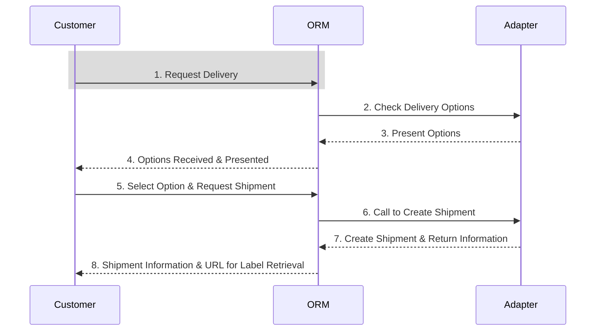

# Building Your Own Afosto Label Adapter

In this guide, we will walk you through the process of creating your own custom Afosto Label Adapter.
This adapter will allow your application to seamlessly intergrate into the Afosto Eco system and provide label
and shipment functionality

## Terminology

- **Option** - an option refers to a configurable set of functionalities that the option represents, this includes
  options like standard, insured, signature required, dropoffs at a parcel point, is delivery at neighbours allowed
- **Carrier** - the carrier that wil transport the Parcel e.g. PostNL, DHL
- **Shipment** - The shipment contains information its contents and the destination it is going,
  the carrier that will be handling the transportation and which option will be used for the shipment.
- **Label** - Labels display important information about a package's destination to a carrier during
  transportation. These labels help describe and specify where the package is going, and in the cases of international
  shipments, what's inside a package.
- **Label Provider** - The processing system that handles the creation of shipments and labels between the label
  provider
  and Afosto ORM
- **Driver** The code written to extend the label functionality within Afosto so that it can communicate with a specific
  Label Provider. There are several ‘official’ Label Providers, and many others written by individuals.
  If the Label Provider that you wish to use doesn’t currently have a driver written for it, you can create your own
  and share it with the us.

## Flow



# implement your own

When creating your own driver there are a few endpoints you should integrate.
we will describe Options and Shipments

- `GET {base-url}/options` - A list of available options provided by the driver
- `GET {base-url}/options/{id}` - returns an option based on its ID
- `POST {base-url}/shipments` - create a shipment
- `GET {base-url}/shipments/{id}` - retrieve a shipment by ID
- `GET {base-url}/shipments/{id}/label` - retrieve a shipping label by ID

## options

Options are used as a powerful mechanism for bundling a range of preferences into a
single, selectable entity. Essentially, an option allows you to consolidate various attributes that define how a
particular Shipment will be transported.

the following list of characteristics are used within Afosto ORM to reduce the list of options presented to the
customer.

- **SameDay**
  Sameday indicates whether the delivery is scheduled for the same day it was initiated, catering to scenarios where
  expedited delivery is necessary.

- **Sunday**:
  Sunday specifies whether the delivery is scheduled for a Sunday, accommodating unique delivery requirements
  associated with weekends.

- **PickupPoint**:
  When enabled, it signifies that the shipment is designated for pickup at a predefined point rather than a traditional
  delivery to a recipient's address.

- **Neighbours allowed**:
  The option allows for flexibility in the delivery process by indicating whether it's acceptable to deliver the
  shipment
  to neighboring addresses when the recipient itself is not available when the package is presented.

- **Signature required**:
  It signifies that a signature is required as proof of delivery, enhancing security and accountability, particularly
  for
  valuable or sensitive items.

- **Age check**:
  The Age check addresses scenarios where a delivery requires an Age check for verification purposes, adding an extra
  layer of security and compliance.

- **DAP**
  DAP indicates whether the seller assumes responsibility for charges and risks associated with the shipment, following
  the "Delivered At Place" (DAP) Incoterm.

- **DDP**
  DAP indicates whether the customer assumes responsibility for charges and risks associated with the shipment,
  following
  the "Delivered Duty Paid" (DDP) Incoterm.

- **Evening Delivery:**
  The scheduled window of the delivery is within the evening hours. This option is particularly useful for customers who
  prefer to receive their shipments during the later part of the day, accommodating their schedules and ensuring a
  convenient delivery experience.

- **Day Delivery**:
  This option means that the delivery is scheduled for the daytime hours. It caters to those who prefer
  to receive their shipments during regular business hours, aligning with typical working schedules and making it
  suitable
  for commercial deliveries and standard residential deliveries.

- **Country**
  Apart from the options defined above, the option also has a selection of countries can be used to ship towards.
  this option lets users define a list of countries where the delivery service operates.
  This customization ensures that the service is accessible only in specified regions, allowing precise control over the
  service's geographical reach.

- **Weight**
  The option defines a upper and lower boundry in which the shipment should fall so that the option is applicable

- **Dimensions**
  The maximal dimensions that the shipment can be for the option

## Shipment

Notify us with status updates by sending a webhook

### Keeping track of shipment status

The driver can notify Afosto ORM about status changes about the parcel.
When the shipment changes status to *in transit* or *deliverd*  a webhook can be send

```json

{
  "data": {
    "reference": "my shipment reference",
    "status": "IN_TRANSIT"
  }
}

```

```json

{
  "data": {
    "reference": "my shipment reference",
    "status": "DELIVERED"
  }
}

```

doing so wil mark the items as Delivered within the Afosto ORM


****